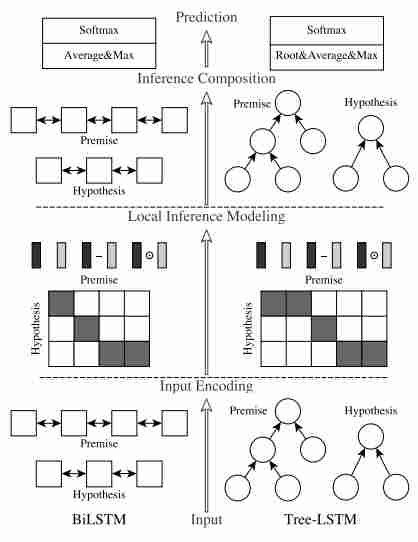

实现了[nlp-beginner](https://github.com/FudanNLP/nlp-beginner)的几个任务，一方面自己练练手，另一方面供刚入门的朋友参考。才学疏浅，难免有不少问题，有任何问题可以发issue或者邮箱联系，万分感谢~

# 任务一：基于机器学习的文本分类
数据集地址：[Classify the sentiment of sentences from the Rotten Tomatoes dataset](https://www.kaggle.com/c/sentiment-analysis-on-movie-reviews)

1. 用`sklearn`实现，`n-gram`特征提取直接用`sklearn`内置的`CountVectorizer`。
2. 用`numpy`实现：
    - 自定义`n-gram`特征抽取类，用`scipy`的`csr_matrix`来保存`doc-ngram`稀疏矩阵；
    - `numpy`实现用于二分类的`Logistic Regression`及用于多分类的`Softmax Regression`；
    - 实现三种梯度更新方式：`BGD`、`SGD`以及`MBGD`；

    |方法|参数|准确度|
    |-----|-----|------|
    |LR (sklearn)|C=0.8; penalty='l1'|0.587|
    |SoftmaxRegression (numpy)|C=0.8; penalty='l1'|0.548|


# 任务二：基于深度学习的文本分类
数据集地址：[Classify the sentiment of sentences from the Rotten Tomatoes dataset](https://www.kaggle.com/c/sentiment-analysis-on-movie-reviews)

1. 老老实实一步步写分词、构建词典、数据向量化、加载词向量等；
2. 用`pytorch`写`RNN`, `GRU`, `LSTM`以及`TextCNN`，其中自己编写的`RNN`, `GRU`, `LSTM`模型已经测试与`pytorch`内部`nn.xxx`一致。
3. 用`torchtext`简化数据的处理操作；

    |方法|参数|准确度|
    |-----|-----|------|
    |RNN|epoch=5; hidden_size = 256; num_layers = 1; bidirectional = True; random embedding|0.629|
    |RNN|epoch=5; hidden_size = 256; num_layers = 1; bidirectional = True; glove_200 embedding|0.633|
    |CNN|epoch=5; num_filters = 200; kernel_sizes = [2, 3, 4]; random embedding|0.654|
    |CNN|epoch=5; num_filters = 200; kernel_sizes = [2, 3, 4]; glove_200 embedding|0.660|
    
 
说明：该实验`glove`词向量对结果提升不大，第四个实验效果较为显著；

# 任务三：基于注意力机制的文本匹配
数据集地址：[SNLI](https://nlp.stanford.edu/projects/snli/)



1. 实现[`ESIM`](https://arxiv.org/pdf/1609.06038v3.pdf)模型，如上图左边所示，模型主要分三层，由下至上：
    - 第一层用`BiLSTM`来对句子的每个词向量进行重新编码，使其具备全局性；
    - 第二层先用`Attention`来提取前提与假设之间的关系，然后重构，以前提为例：
    ```python
    # x1为前提，x2为假设，new_embed1是假设x1经过BiLSTM后的值，weight2是x2的每个词对x1的归一化相关程度，即attention值。
    # 1. 对假设x2进行加权求和，该值提取出了x2中与x1相关的部分；
    x1_align = torch.matmul(weight2, x2)
    # 2. 将四部分连接起来，用相减以及相乘来实现前提与假设的“交互推断”，文中说可以使得局部信息（如矛盾关系）更加明显；
    x1_combined = torch.cat([new_embed1, x1_align, new_embed1 - x1_align, new_embed1 * x1_align],dim=-1)
    ```
    - 第三层是将重构后的前提和假设再放到一个`BiLSTM`中，文中说为了控制模型复杂度，在传入前先经过一个单层`FFN`并且`ReLU`一下。
    - 第四层是输出层，先`pooling`一下，文中前提和假设都用了`max-pooling`以及`average-pooling`两种形式，再对两者连接后MLP输出。

2. 注意用`torchtext`读取`json`文件的方式，及依赖解析数据的读取方式。其实`torchtext`内部有`dataset.nli`模块实现了
`nli`数据读取方式，但是在代码中我还是用原版的`FIELD`来实现，便于理解其内部的处理流程。

|model test accuracy|paper test accuracy|
|-----|-----|
|0.86|0.88|


# 任务四：基于LSTM+CRF的序列标注
数据集地址：[CONLL 2003](https://www.clips.uantwerpen.be/conll2003/ner/)

采用`CNN+BiLSTM+CRF`结构，复现论文[`End-to-end Sequence Labeling via Bi-directional LSTM-CNNs-CRF`](https://arxiv.org/pdf/1603.01354.pdf)

- 数据采用`BIOES`结构，用`bio2bioes.py`进行转换。
- 关于预处理，将数字都变为0；
- 设置预训练`embedding`的时候需注意模糊匹配（大小写）；
- 设置`vocab`的时候使要用到`train`以及`dev`+`test`中出现在`embedding`中的词；
- 关于初始化，论文里有详细的设置，注意的是`LSTM`里面的`forget gate`的 `bias`初始为1，因为开始的时候记忆准确度不高。
- 关于`dropout`,`LSTM`的输入和输出的时候都加`dropout`；字符`embedding`进入`CNN`前也要`dropout`。
- 关于优化器，论文是采用了`SGD`，每个epoch都对学习率进行调整，注意这里不能用`pytorch`的`SGD`中的`weight decay`，因为它是对权重的衰减（L2正则），而我们要的是对学习率进行衰减。

|embedding|entity-level F1|paper result|
|----|------|---| 
|random (uniform)|83.18|80.76|
|glove 100|90.7|91.21|


注意点：使用`torchtext`进行文本处理，需注意要由于`torchtext`只能处理`tsv/csv/json`格式的文本，这里需要自己
从文本读取的句子，也要自定义`Dataset`，`make Example`时的两种表现形式：
   - `list`形式，此时构建`FIELD`的时候`FIELD`内部的`tokenizer`不会起作用;
   - `str`形式，`word`空格隔开，此时构建`FIELD`的时候必须传入`tokenizer=lambda x:x.split()`（针对该任务）来覆盖内部的`tokenizer`,
    否则会用内部的来分词，得到的`word`可能不一样了，也就和`label`不对应了。
    
# 任务五：基于神经网络的语言模型

用`CharRNN`来写诗，评价指标为困惑度，是交叉熵损失取`exp`。
1. 采用单向`LSTM`，输入的最后一个为`[EOS]`，对应的`target`为输入右移一位；
2. 控制诗的长度为`MAX_LEN`，以一行为单位进行切分，即将超长的诗切分为若干短诗；
3. 训练200个`epoch`后，困惑度为400左右。
>Input the first word or press Ctrl-C to exit: 鸟
>
>鸟渠霭乌秋，游王居信知。鹏未弟休不，深沙由意。寥五将不，两迹悄臣。生微心日，水复师尘。来称簸更，影乏魍无。